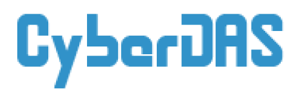

<br />
<p align="center">
  <a href="https://github.com/CyberDAS-Dev/API">
    
  </a>

  <h3 align="center">CyberDAS Frontend</h3>
  <p align="center">
    Сайт общежития ДАС МГУ, работающий на базе <a href="https://github.com/CyberDAS-Dev/API">CyberDAS API</a>
    <br />
    <br />
    <a href="https://github.com/CyberDAS-Dev/Frontend/issues">Сообщить об ошибке</a>
    ·
    <a href="https://github.com/CyberDAS-Dev/Frontend/issues">Предложить улучшение</a>
  </p>
</p>

<br>
<details open="open">
  <summary>Содержание</summary>
  <ol>
    <li><a href="#о-проекте">О проекте</a></li>
    <li>
      <a href="#приступаем-к-работе">Приступаем к работе</a>
      <ul>
        <li><a href="#необходимое-по">Необходимое ПО</a></li>
        <li><a href="#установка">Установка</a></li>
        <li><a href="#развертывание">Развертывание</a></li>
      </ul>
    </li>
    <li><a href="#дорожная-карта">Дорожная карта</a></li>
    <li><a href="#содействие">Содействие</a></li>
    <li><a href="#лицензия">Лицензия</a></li>
    <li><a href="#контакты">Контакты</a></li>
    <li><a href="#благодарности">Благодарности</a></li>
  </ol>
</details>
<br>

<div align="center">
  <a href="https://sass-lang.com/">
    
  </a>
  <a href="https://reactjs.org/">
    
  </a>
  <a href="https://redux-toolkit.js.org/">
    
  </a>
  
</div>

<br>
<hr>
<br>

<div align="center">
    </img>
</div>
<br>

## О проекте

Вы когда-нибудь стояли в очереди на заселение по несколько часов? Жили пару дней без света в коридоре, потому что не хотелось подниматься к коменданту? Тогда вам знакомо, как неприветлива бывает бюрократия.

Этот проект призван упростить жизнь студентов в общежитии, избавив от их бюрократических рутин и дав им новые, цифровые, возможности.

Мы хотим дать студентам возможность:

-   Оставлять заявки на вызов технических служб не выходя из комнаты
-   Дистанционно записываться на заселение и не тратить свою жизнь в очереди
-   Составлять и отправлять заявления в администрацию без особых усилий
-   Делиться ненужными вещами без пабликов-барахолок в ВК
-   И многое другое...

Проект создается для [общежития ДАС МГУ](https://das.msk.ru), работает на базе [API](https://github.com/CyberDAS-Dev/API).

Если ты тоже хочешь помочь и умеешь в дизайн или код, то пиши <a href="#контакты">нам</a>!

## Приступаем к работе

Следуй этим шагам, чтобы локально запустить текующую версию проекта.

### Необходимое ПО

-   Node.js (>=12)
-   Yarn (опционально)

### Установка

1. Скопируйте репозиторий
    ```bash
    git clone https://github.com/CyberDAS-Dev/Frontend.git
    ```
2. Установите зависимости проекта.
    ```bash
    npm i
    ```
    или
    ```bash
    yarn
    ```
3. Запустите локальный сервер для разработки, приложение будет доступно по адресу [http://localhost:3000](http://localhost:3000)
    ```bash
    npm start
    ```
    или
    ```bash
    yarn start
    ```

### Развертывание

1. Соберите приложение, готовое к установке на сервер, все нужные файлы находятся в директории build
    ```bash
    npm run build
    ```
    или
    ```bash
    yarn build
    ```

## Дорожная карта

Смотрите [open issues](https://github.com/CyberDAS-Dev/Frontend/issues) для информации о планируемых улучшениях и известных проблемах.

## Содействие

Совместная разработка это то, что делает опен-сорс сообщество таким удивительным местом для обучения и творчества. Мы **ценим** любой ваш вклад в проект.

1. Сделайте копию (Fork) проекта
2. Создайте свою ветку для работы (`git checkout -b feature/AmazingFeature`)
3. Сохраните изменения (`git commit -m 'Add some AmazingFeature'`)
4. Отправьте их в удаленную ветку (`git push origin feature/AmazingFeature`)
5. Создайте Pull Request

## Лицензия

Распространяется под лицензией MIT. Смотрите `LICENSE` для дополнительной информации.

## Контакты

marcusymka@gmail.com
<br>
[telegram](https://t.me/foxxxxxxxxxxxxxxxxxxxxxxxxxxx)

Ссылка на проект: [https://github.com/CyberDAS-Dev/API](https://github.com/CyberDAS-Dev/API)

## Благодарности

-   [Александр Букреев](https://github.com/TarLung), оригинальный создатель проекта
-   [Студенческий комитет ДАС МГУ](https://vk.com/studcomdas)
-   [Best-README-Template](https://github.com/othneildrew/Best-README-Template)
